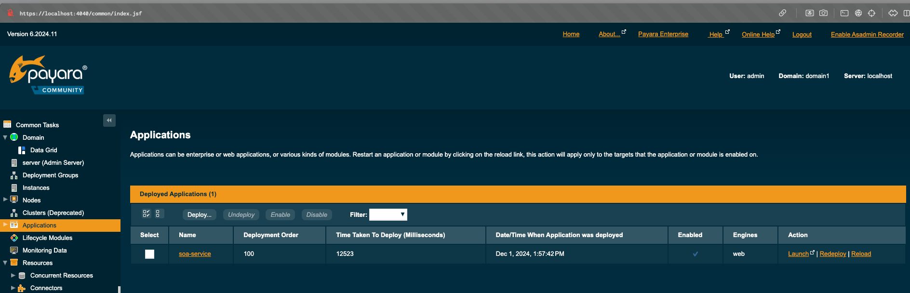
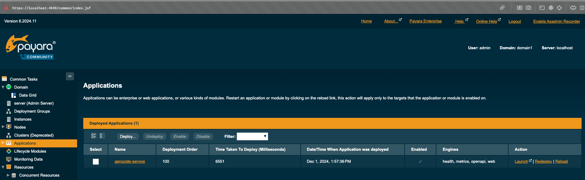

# SOA

# Запуск сервера
1) Поднять все необходимые докер контейнеры
```bash
bash start.sh
```
2) Проверить правильность инициализации
```bash
curl https://localhost:7171/soa-service/ping
curl https://localhost:8383/genocide-service/genocide/ping
```
3) Заполнение базы данных.
(Только для первого раза) Нужно подключиться к бд (данные можно найти в docker-compose.yaml)
и выполнить скрипт по пути soa/src/main/resources/init.sql
4) Поздравляю! Все работает

p.s. Если что-то не работает, а именно curl запросы не выдают ожидаемый ответ (code: 200, responseBody: pong), то идем 
и проверяем настройки по ссылкам https://localhost:4040/common/index.jsf и https://localhost:4949/common/index.jsf(логин: admin, пароль: admin).
Может быть такое что после авторизации мы получим страницу 404, тут нужно просто еще раз перейти по ссылке по которой происходила авторизация.
Там мы должны увидеть по одному приложению по каждой ссылке





# Запуск клиента
```
npm i
npm start
```
